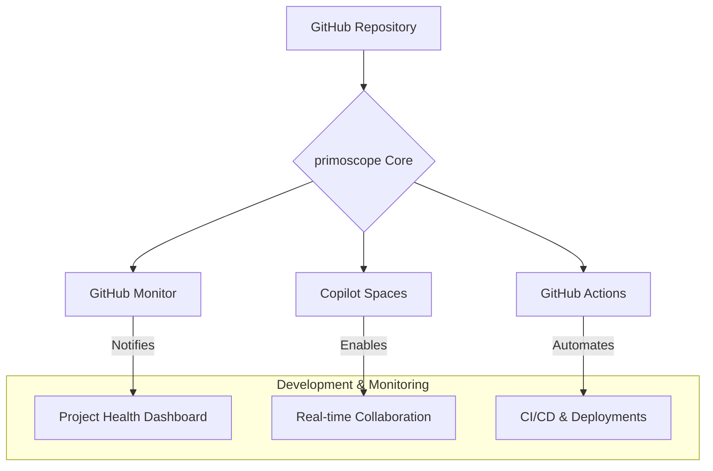

  <!-- TODO: Add a project logo or banner -->
  <!--  -->

  # primoscope

  **Next-Generation Project Intelligence & Collaboration Hub**

  
  
  
  

---

## 🚀 Overview

**primoscope** is a forward-thinking project designed to create an intelligent, self-monitoring, and collaborative development ecosystem. By deeply integrating with GitHub's most powerful features like **GitHub Monitor** and **Copilot Spaces**, primoscope transforms a standard repository into a dynamic project management and development hub.

This project serves as both a template and a live demonstration of how to build a highly efficient, transparent, and AI-assisted workflow on GitHub.

---

## ✨ Features

| Feature                          | Description                                                                                                                              | Status      |
| -------------------------------- | ---------------------------------------------------------------------------------------------------------------------------------------- | ----------- |
| **Real-Time Project Monitoring** | Leverages **GitHub Monitor** to provide live insights into repository activity, issue velocity, and pull request health.                   | ✅ Active    |
| **AI-Powered Collaboration**     | Utilizes **Copilot Spaces** for seamless, cloud-based development environments where teams can prototype and build with AI assistance.     | ✅ Active    |
| **Automated Workflows**          | Implements GitHub Actions for CI/CD, automated labeling, and release management to reduce manual overhead.                                 | 🚧 Planned  |
| **Extensible Architecture**      | Designed to be easily extended with new integrations, webhooks, and monitoring tools to fit any project's needs.                           | ✅ Active    |
| **Interactive UI (Planned)**     | A future-planned web interface to visualize repository analytics and manage project settings in a user-friendly dashboard.                 | 📅 On Roadmap |

---

## 🛠️ Tech Stack & Tools

---

## ⚙️ System Architecture

Below is a conceptual diagram of how `primoscope` integrates various GitHub services.

<!-- TODO: Create and add an architecture diagram -->

*This diagram illustrates the flow of information and automation within the project.*

---

## 🚀 Getting Started

### Prerequisites

- A GitHub account with administrative access to a repository.
- Basic familiarity with GitHub Issues, Pull Requests, and Actions.

### 1. GitHub Monitor Integration

GitHub Monitor is key to proactive project health tracking.

1.  **Install the App:**
    - Visit the [**GitHub Monitor**](https://github.com/marketplace/github-monitor) page on the Marketplace.
    - Click `Install` and authorize it for your `primoscope/primoscope` repository.

2.  **Configure Notifications:**
    - In the Monitor dashboard, select the events you want to track (e.g., new issues, stale PRs, release drafts).
    - Connect your preferred notification channels (Slack, Email, or a custom Webhook) for real-time alerts.

3.  **Verify:**
    - Create a test issue or PR to confirm that you receive a notification, and the activity appears in the Monitor dashboard.

### 2. Copilot Spaces (RGC) Integration

Use Copilot Spaces for a powerful, collaborative development experience.

1.  **Create a Space:**
    - Navigate to [**GitHub Copilot Spaces**](https://github.com/features/copilot-spaces).
    - Initiate a new Space and link it to this repository (`primoscope/primoscope`).

2.  **Configure the Environment:**
    - Inside the Space settings, ensure RGC (Remote GitHub Collaboration) is enabled.
    - Customize the dev container configuration (`.devcontainer/devcontainer.json`) if needed to standardize the environment for all collaborators.

3.  **Collaborate:**
    - Invite team members to the Space.
    - Start a coding session to experience real-time, AI-assisted pair programming and prototyping.

---

## 📋 Usage

-   **As a Project Manager:** Use the **GitHub Monitor** dashboard to get a high-level overview of project velocity, identify bottlenecks in the PR queue, and track issue resolution times.
-   **As a Developer:** Spin up a **Copilot Space** from any issue or pull request to get a fully configured, ready-to-code environment. Collaborate with peers and leverage Copilot to write better code, faster.
-   **As a Contributor:** Refer to our contribution guidelines, pick an open issue, and submit a pull request. Our automated workflows will handle the rest.

---

## 🗺️ Roadmap

We have an exciting vision for `primoscope`! Here are some of the features we're planning to implement:

-   [ ] **Phase 1: Core Enhancements**
    -   [ ] Develop a comprehensive suite of GitHub Actions for automated release notes and changelogs.
    -   [ ] Create standardized issue and PR templates.
-   [ ] **Phase 2: User Interface**
    -   [ ] Design and build a simple web dashboard to visualize repository analytics.
    -   [ ] Allow configuration of monitoring rules directly from the UI.
-   [ ] **Phase 3: Deeper AI Integration**
    -   [ ] Use AI to auto-triage issues based on their content.
    -   [ ] Generate automated summaries of complex pull requests.

---

## 🙌 How to Contribute

Contributions are what make the open-source community such an amazing place to learn, inspire, and create. Any contributions you make are **greatly appreciated**.

1.  **Fork the Project:**
    Click the `Fork` button at the top right of this page.
2.  **Create your Feature Branch:**
    `git checkout -b feature/AmazingFeature`
3.  **Commit your Changes:**
    `git commit -m 'Add some AmazingFeature'`
4.  **Push to the Branch:**
    `git push origin feature/AmazingFeature`
5.  **Open a Pull Request:**
    Open a pull request against the `main` branch of this repository.

Please read our [**Contributing Guidelines**](CONTRIBUTING.md) for more details on our code of conduct and the process for submitting pull requests.

---

## 📄 License

Distributed under the MIT License. See `LICENSE` for more information.

---

## 🤝 Acknowledgements

A special thanks to the following services and communities for making this project possible:

-   [GitHub](https://github.com)
-   [GitHub Monitor](https://github.com/marketplace/github-monitor)
-   [Copilot Spaces](https://github.com/features/copilot-spaces)
-   [Shields.io](https://shields.io) for the awesome badges.
