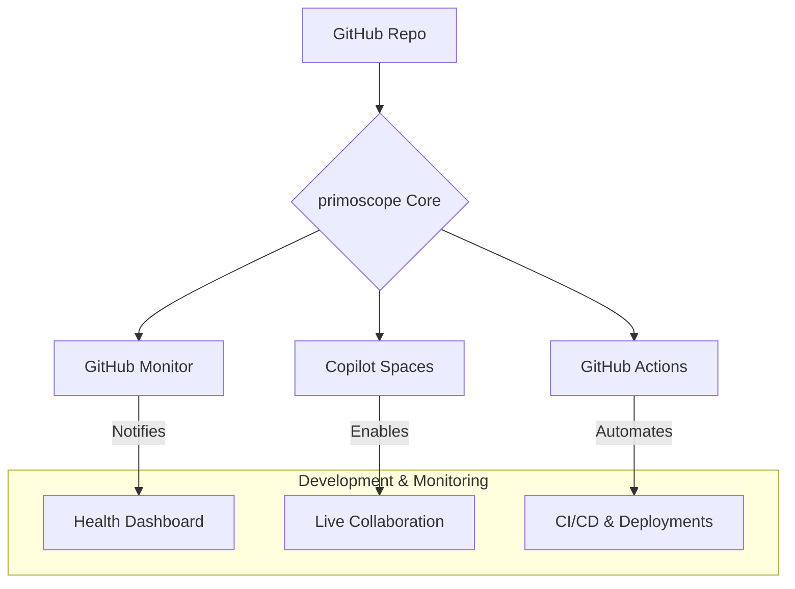

  <!-- TODO: Replace with your project logo or banner -->
  <!--  -->

  # primoscope

  **Next-Generation Project Intelligence & Collaboration Hub**

  
  
  
  

---

## 📑 Table of Contents

- [🚀 Overview](#-overview)  
- [✨ Features](#-features)  
- [🛠️ Tech Stack & Tools](#️-tech-stack--tools)  
- [⚙️ System Architecture](#️-system-architecture)  
- [🚀 Getting Started](#-getting-started)  
- [📋 Usage](#-usage)  
- [🗺️ Roadmap](#️-roadmap)  
- [🙌 Contributing](#-contributing)  
- [📄 License](#-license)  
- [🤝 Acknowledgements](#-acknowledgements)  

---

## 🚀 Overview

**primoscope** is a forward-thinking project that transforms any GitHub repository into an intelligent, self-monitoring, and collaborative development hub. By integrating deeply with GitHub Monitor and Copilot Spaces, primoscope provides:

- Real-time insights into repository health and activity
- AI-assisted, cloud-based development environments
- Automated workflows to reduce manual overhead
- An extensible architecture for custom integrations

This repository serves both as a template and a live demo of building an AI-powered, transparent, and high-velocity GitHub workflow.

---

## ✨ Features

| Feature                          | Description                                                                                                                          | Status      |
| -------------------------------- | ------------------------------------------------------------------------------------------------------------------------------------ | ----------- |
| **Real-Time Project Monitoring** | Live insights into issue velocity, PR health, and activity trends via **GitHub Monitor**.                                            | ✅ Active   |
| **AI-Powered Collaboration**     | Instant, cloud-native dev environments powered by **Copilot Spaces** for pair programming and prototyping.                            | ✅ Active   |
| **Automated Workflows**          | CI/CD, automatic labeling, release management, and more through **GitHub Actions**.                                                  | 🚧 Planned  |
| **Extensible Architecture**      | Plug in additional webhooks, services, and monitoring tools to tailor primoscope to any project.                                      | ✅ Active   |
| **Interactive UI (Future)**      | A web dashboard to visualize analytics and configure monitoring rules (coming soon).                                                 | 📅 On Roadmap |

---

## 🛠️ Tech Stack & Tools

---

## ⚙️ System Architecture

Below is a conceptual diagram illustrating how `primoscope` ties together GitHub services:

*Figure: Information flow and automation within primoscope.*

---

## 🚀 Getting Started

### Prerequisites

- A GitHub account with admin access to a repository  
- Familiarity with GitHub Issues, Pull Requests, and Actions  

### 1. Install GitHub Monitor

1. Visit the [GitHub Monitor](https://github.com/marketplace/github-monitor) Marketplace page.  
2. Click **Install**, authorize it for your `primoscope/primoscope` repo.  
3. Configure events (issues, stale PRs, releases) and connect notifications (Slack, Email, Webhook).  
4. Verify by creating a test issue or PR and confirming alerts appear.

### 2. Configure Copilot Spaces

1. Navigate to [GitHub Copilot Spaces](https://github.com/features/copilot-spaces).  
2. Create a new Space, linking it to `primoscope/primoscope`.  
3. Enable RGC (Remote GitHub Collaboration) in Space settings.  
4. (Optional) Customize your `.devcontainer/devcontainer.json` for reproducible environments.  
5. Invite collaborators and start AI-assisted coding sessions.

---

## 📋 Usage

- **Project Managers**: Monitor velocity, bottlenecks, and resolution trends via the Monitor dashboard.  
- **Developers**: Launch a Copilot Space from any issue/PR for a fully configured dev environment.  
- **Contributors**: Browse open issues, submit PRs, and let automated workflows handle testing and labels.

---

## 🗺️ Roadmap

- **Phase 1: Core Enhancements**
  - [ ] Automated changelogs & release notes via Actions  
  - [ ] Standardized issue & PR templates  
- **Phase 2: User Interface**
  - [ ] Web dashboard for analytics visualization  
  - [ ] In-UI monitoring rule configuration  
- **Phase 3: Deeper AI Integration**
  - [ ] AI-driven issue triage  
  - [ ] Auto-summaries of complex PRs  

---

## 🙌 Contributing

Your contributions make primoscope better! Please:

1. Fork the repo  
2. Create a branch: `git checkout -b feature/YourFeature`  
3. Commit your changes: `git commit -m 'Add YourFeature'`  
4. Push to your branch: `git push origin feature/YourFeature`  
5. Open a PR against `main`

See [CONTRIBUTING.md](CONTRIBUTING.md) for detailed guidelines.

---

## 📄 License

Distributed under the MIT License. See [LICENSE](LICENSE) for details.

---

## 🤝 Acknowledgements

Thanks to the tools and communities that power this project:

- [GitHub](https://github.com)  
- [GitHub Monitor](https://github.com/marketplace/github-monitor)  
- [Copilot Spaces](https://github.com/features/copilot-spaces)  
- [Shields.io](https://shields.io)  
